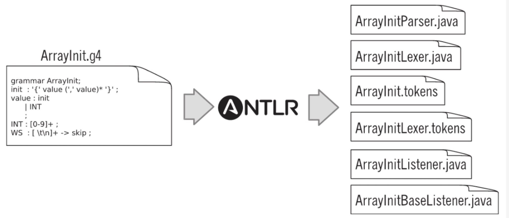

## antlr4安装

#### UNIX环境

* Install Java (version 1.6 or higher)
* Download
```
$ cd /usr/local/lib
$ curl -O https://www.antlr.org/download/antlr-4.7.1-complete.jar
```
* Add antlr-4.7.1-complete.jar to your CLASSPATH:
```$xslt
$ export CLASSPATH=".:/usr/local/lib/antlr-4.7.1-complete.jar:$CLASSPATH"
```
* Create aliases for the ANTLR Tool, and TestRig.
```$xslt
$ alias antlr4='java -Xmx500M -cp "/usr/local/lib/antlr-4.7.1-complete.jar:$CLASSPATH" org.antlr.v4.Tool'
$ alias grun='java -Xmx500M -cp "/usr/local/lib/antlr-4.7.1-complete.jar:$CLASSPATH" org.antlr.v4.gui.TestRig'
```

### A First Example

* In a temporary directory, put the following grammar inside file Hello.g4: Hello.g4
```$xslt
// Define a grammar called Hello
grammar Hello;
r  : 'hello' ID ;         // match keyword hello followed by an identifier
ID : [a-z]+ ;             // match lower-case identifiers
WS : [ \t\r\n]+ -> skip ; // skip spaces, tabs, newlines
```

* Then run ANTLR the tool on it:
```$xslt
$ cd /tmp
$ antlr4 Hello.g4
$ javac Hello*.java
```

* Now test it:
```$xslt
$ grun Hello r -tree
(Now enter something like the string below)
hello parrt
(now,do:)
^D
(The output:)
(r hello parrt)
(That ^D means EOF on unix; it's ^Z in Windows.) The -tree option prints the parse tree in LISP notation.
It's nicer to look at parse trees visually.
$ grun Hello r -gui
hello parrt
^D
```


-----------------------
### 语法分析的过程
* 可以分为两个阶段
  * 将自负聚集为单词或者符号（词法符号，token）的过程称为词法分析（lexical analysis），词法分析可以将相关的符号归类，例如INT，ID，FLOAT等。词法符号包含至少两部分信息：
  词法符号的类型和词法符号的文本
  * 将输入的词法符号被"消费"以识别语句结构，构建称为一个语法分析书（parse-tree）或者句法树（syntax tree）的结构，记录语法分析器识别出输入语句结构的过程，以及该结构的各组成部分。

如下图


************************************

### antlr4生成文件的过程

当我们执行[ArrayInit.g4](src/main/java/cn/icrn/example2/ArrayInit.g4)
```$xslt
antlr4 ArrayInit.g4  
```
会根据语法生成ANTLR文件


介绍一下生成的文件：
* ArrayInitParse.java: 该文件包含一个语法分析器类的定义，这个语法分析器专门用来识别我们的"数组语言"的语法ArrayInit
```$xslt
public class ArrayInitParser extends Parser { ... }
```
在该类中，每条规则都有对应的方法，除此之外，还有一些其他的辅助代码。
* ArrayInitLexer.java: ANTLR能过自动识别出我们的语法中的文法规则和词法规则。这个文件包含的词法分析器的类定义，他是由ANTLR通过分析词法规则INT 和 WS，
以及语法中的字面值'{' ',' '}'生成的。

```$xslt
public class ArrayInitLexer extends Lexer { ... }
```

* ArrayInit.tokens: ANTLR会给每个我们定义的词法符号制定一个数字形式的类型，然后将他们的对应关系存储到该文件中。有时候，我们需要将一个大型语法切分为多个更小的语法，
在这种情况下，这个文件就有用了。通过它，ANTLR可以在多个小型语法间同步全部的词法符号类型。

* ArrayInitListener.java ArrayInitBaseListener.java: 默认情况下，ANTLR生成的语法分析器能将输入文本转换为一颗语法分析树。在遍历语法分析树，遍历器能够触发一系列"事件"
，并通知我们提供的监听器对象。ArrayInitListener接口给出了这些回调方法的定义，我们可以实现它来完成自定义的功能。ArrayInitBaseListener时该接口的默认实现类，为其中每个方法
提供了一个空实现。

### 测试：
编译ArrayInit*.java文件
```$xslt
$ javac *.java
```

语法测试
```$xslt
$ grun ArrayInit init -tokens
{99, 3, 454}

[@0,0:0='{',<'{'>,1:0]
[@1,1:2='99',<INT>,1:1]
[@2,3:3=',',<','>,1:3]
[@3,5:5='3',<INT>,1:5]
[@4,6:6=',',<','>,1:6]
[@5,8:10='454',<INT>,1:8]
[@6,11:11='}',<'}'>,1:11]
[@7,14:13='<EOF>',<EOF>,3:0]
```

解析一下，例如： [@5,8:10='454',<INT>,1:8]
* 代表的是它是第5个词法符号，由第8和第10个字符组成，包含文本是454，类型是INT，位于输入文本的第一行第8个字符。
* 注意：输出的结果中不包含空格和换行符，这是因为在我们的语法中，WS规则中的"->skip" 指令将他们丢弃了。